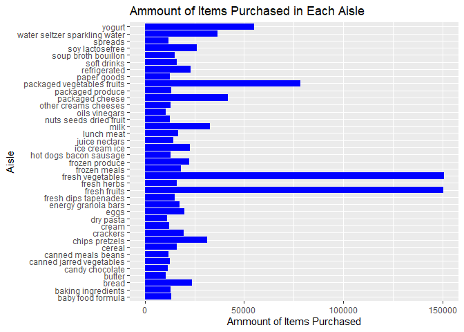

p8105\_hw3\_mrc2229
================
Matthew Curran
October 12, 2019

Problem 1
=========

Bring in instacart data
-----------------------

``` r
library(p8105.datasets)
data("instacart")
```

Examining the instacart data
----------------------------

There are 1384617 observations in the instacart dataset and 15 variables in the instacart data set. Some of the key variables are product\_name, which shows the product purchased; aisle, which tells us the aisle the purchased item comes from; and order\_id, which tells us the id of the person who ordered a certain item. So we can see things like that person with order\_id 1 got 2 items from aisle 24, the fresh fruit aisle. The instacart dataset also gives information on the time an order was placed. As an example, the person with order\_id 1 made their order at the 10th hour of the day.

Examining the aisles
--------------------

There are 134 aisles in total and the most items are ordered from the fresh vegetables and fresh fruits aisles.

Plot of number of items ordered in each aisle
---------------------------------------------

``` r
items_per_aisle_plot = instacart %>%
  count(aisle,name="aisle_count") %>%
  filter(aisle_count>10000) %>%
  arrange (desc(aisle)) %>%
  ggplot(aes(x=aisle, y=aisle_count)) +
  geom_bar(stat="identity", fill="blue") +
  labs(
    title = "Ammount of Items Purchased in Each Aisle",
    x = "Aisle",
    y ="Ammount of Items Purchased"
  )

items_per_aisle_plot + coord_flip()
```


